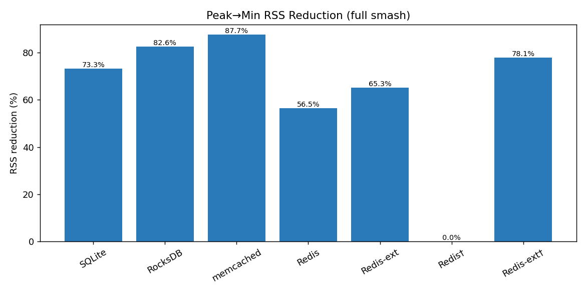
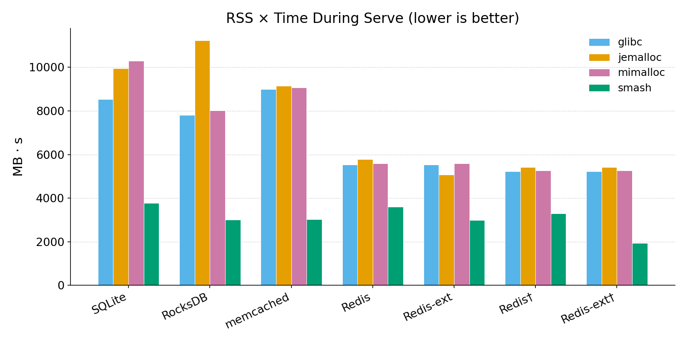
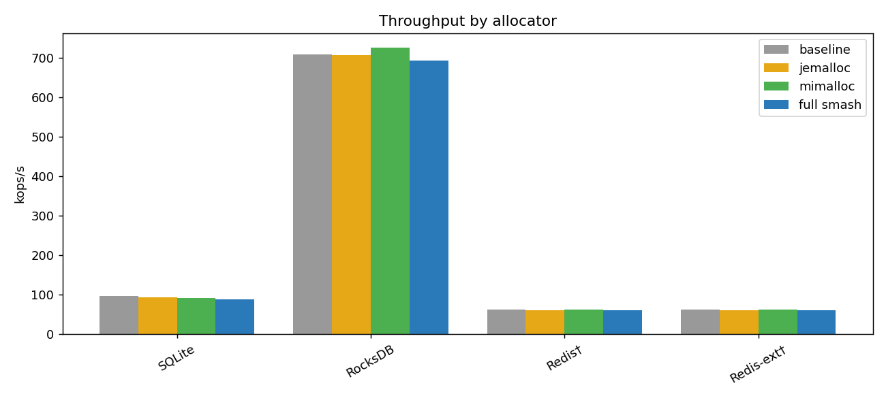

# smash

**smash** — a compression-aware memory allocator that transparently compresses cold pages to reduce resident set size (RSS).

## Overview

Smash is a drop-in malloc replacement that monitors page access patterns and compresses pages that haven't been touched recently. When compressed pages are accessed again, a signal handler transparently decompresses them before the application sees the data. Smash reduces physical memory usage for applications with large working sets where significant portions of allocated memory are idle at any given time.

### Key Features

- **Transparent compression**: No application changes required, works via malloc interposition.
- **ROI-driven compression gate**: A return-on-investment model decides *whether* each cold page is worth compressing, weighing its observed compressibility and observed compression cost against its accumulated cold time. libsmash ships **single-tier** (zstd-1); a second deep tier (zstd-9) exists behind a compile flag (`-DSMASH_ENABLE_DEEP_TIER`) but is **off by default** — on real per-page heap data zstd-9 gives ~1.0× the blob size of zstd-1 (its larger match window needs >4 KiB input), so the second tier costs CPU with no RSS gain. See [Compression tiers](#compression-tiers).
- **Per-origin learning**: Compression-ratio and compression-cost statistics are kept per `(arena, size class)`, so call-site arena routing translates directly into more accurate ROI decisions.
- **Adaptive worker pool**: The compressor scales its active worker count each tick using Little's Law (`N = ⌈λ/μ⌉`), so an idle process uses one worker and a bulk-allocation phase uses several.

## How It Works

1. **Allocation**: smash replaces malloc/free via [alloc8](https://github.com/emeryberger/alloc8) interposition. All slab data pages come from a single large virtual memory reservation (VmRegion). A return-address hash routes calls from the same call site into the same arena, producing structurally homogeneous pages.

2. **Access tracking**: A background compressor thread periodically sets active pages to read-only (`mprotect PROT_READ`). Write faults mark pages as "accessed"; pages without writes across multiple intervals are considered cold.

3. **Compression**: Cold pages that clear the ROI gate are compressed with zstd-1 (the default single tier), the decision keyed on the page's `(arena, size class)` observed ratio and observed compression cost. Physical backing is released (`MADV_FREE_REUSABLE` on macOS, `MADV_DONTNEED` on Linux); compressed data is stored in a separate sharded region. The algorithm chosen at compress time is final — there is no later upgrade path; a page stays as-is until it is decompressed by an access.

4. **Decompression**: When the application accesses a compressed page, a SIGSEGV/SIGBUS handler recommits the page, decompresses the data, and resumes execution transparently.

## Results

Full smash vs. baseline (glibc malloc) across seven workloads, measured on an AMD EPYC 9R14 (192 vCPUs, 1.5 TB RAM, Amazon Linux 2023, kernel 6.12). Each app fills, cools (10–30 s idle), then serves (hot-set queries only); **RSS reduction** is peak → minimum RSS during cooling, **AUC reduction** is the reduction in the integral of RSS over the serve phase (MB·s — lower = less memory consumed while serving live traffic), and **throughput** is application ops/s during serve.

| Workload | Peak → Min RSS | RSS reduction | AUC reduction | Throughput vs baseline |
|----------|---------------:|--------------:|--------------:|-----------------------:|
| SQLite (in-memory DB)        | 535 → 28 MiB | 73.3 % | 55.8 % | 0.91× (87k vs 96k ops/s) |
| RocksDB (block cache)        | 290 → 46 MiB | 84.0 % | 61.5 % | 0.98× (676k vs 689k ops/s) |
| memcached (slab KV)          | 300 → 36 MiB | 87.8 % | 66.3 % | 1.05× (189k vs 180k ops/s) |
| Redis (stock)                | 287 → 120 MiB | 58.0 % | 35.1 % | 0.75× (47k vs 62k ops/s) |
| Redis-ext (50 % DELETE)      | 287 → 96 MiB | 68.7 % | 46.0 % | 0.84× (52k vs 62k ops/s) |
| Redis-patched (idle-mode)    | 285 → 120 MiB | 57.8 % | 36.9 % | 0.93× (57k vs 61k ops/s) |
| Redis-ext-patched            | 284 → 60 MiB | 78.8 % | 62.8 % | 1.00× (60k vs 60k ops/s) |

RSS reductions of **58–88 %** across all seven workloads. Throughput measured with `redis-benchmark` (Redis), `memtier_benchmark` (memcached, 4 threads × 10 clients), and application ops/s (SQLite, RocksDB). Memcached is 5 % *faster* under smash — compressed cold slabs reduce memory-bandwidth/TLB pressure on the hot working set. Serve-phase AUC reduction of **35–66 %** shows that compressed pages stay reclaimed even while the application serves live hot-set queries (only 5 % of data is accessed during serve).

These numbers come from `bench/run_paper_experiments.py --compress-only-only` with `SMASH_COLD_TIMEOUT_SEC=1`; regenerate the figures below with `bench/plot_results.py` (see [Benchmarks](#benchmarks)).





### Four-way allocator comparison (redis-benchmark, 50 clients)

Measured with `redis-benchmark -c 50 -n 200000 -t get` on Redis with 200K×1KB keys after 15s cooling. Uses the standard `redis-benchmark` tool (pipelined, multi-connection) — NOT single-threaded socket loops which bottleneck on the client.

| Allocator | Peak RSS | Cool RSS | Reduction | GET (cold→warm) | GET (warm) | p50 |
|-----------|----------|----------|-----------|-----------------|------------|-----|
| glibc | 222 MB | 222 MB | 0% | 49,875 rps | 61,425 rps | 0.39 ms |
| jemalloc | 224 MB | 224 MB | 0% | 45,589 rps | 45,746 rps | 0.58 ms |
| mimalloc | 217 MB | 217 MB | 0% | 53,505 rps | 56,738 rps | 0.46 ms |
| **smash** | 232 MB | **28 MB** | **87.7%** | **54,765 rps** | **58,754 rps** | 0.47 ms |

Smash achieves 87.7% RSS reduction with only 4% warm-throughput overhead vs glibc (59K vs 61K rps). Cold-access throughput is competitive with mimalloc and faster than jemalloc — the decompression cost is amortized across pages (16 objects/page) and pipelined by the fault handler's prefetch.

Reproduce: `python3 bench/bench_redis_4way.py` (from the build directory with `libsmash.so`).

## Why Not Just Use zswap?

On well-provisioned servers, the Linux kernel's compression cache (zswap) is effectively inert: it only compresses pages evicted under memory pressure, and the kernel strongly prefers evicting file-backed pages over swapping anonymous heap data. Smash compresses proactively based on per-page access tracking — no pressure required.

### Apples-to-apples: same cgroup cap, glibc+zswap vs smash

The fair comparison is: **given the same memory budget, which delivers better RSS, latency, and throughput?** Both configurations run inside the same cgroup `MemoryHigh` cap, both benefit from file page eviction, both have zswap available.

**Measured on EPYC 9R14, 192 vCPUs, 1.5 TB RAM, kernel 6.12, zswap zstd/zbud, 4 GB swap:**

| Workload (cap) | Config | Min RSS | Throughput | GET/cold p99 | zswap pages |
|---|---|---:|---:|---:|---:|
| **SQLite (200M)** | baseline (no cap) | 355 MiB | 97k ops/s | 1.8 µs | 0 |
| | glibc + zswap | 101 MiB | 90k ops/s | 1853 µs | 0 |
| | smash + zswap | 130 MiB | 88k ops/s | 3676 µs | 0 |
| **Redis (200M)** | baseline (no cap) | 244 MiB | 65k rps | 0.8 ms | 0 |
| | glibc + zswap | 154 MiB | 30k rps | 3.5 ms | 25k |
| | smash + zswap | 49 MiB | 14k rps | 10.5 ms | 71k |
| **memcached (150M)** | baseline (no cap) | 232 MiB | 200k rps | 0.19 ms | 0 |
| | glibc + zswap | 144 MiB | 211k rps | 0.18 ms | 23k |
| | smash + zswap | **12 MiB** | 199k rps | 0.18 ms | 513 |

**Smash wins on memcached**: same throughput and latency, but **12 MiB vs 144 MiB** min-RSS — smash compressed the cold slabs proactively so the cgroup barely needed to push anything to swap (513 pages vs 23k pages). This is the ideal case: the working set fits in the cap even after smash's CompressStore overhead.

**zswap wins on SQLite and Redis**: inside a tight cgroup, the kernel reclaims smash's own CompressStore pages into swap (71k zswap pages on Redis!). Accessing compressed data then requires a double fault (swap-in the compressed blob, then decompress). This makes smash's cold latency **worse** than zswap's single-fault path.

### When smash wins vs when zswap wins

| Scenario | Winner | Why |
|----------|--------|-----|
| Well-provisioned server (no memory pressure) | **smash** | Proactive compression with 103 µs latency; zswap does nothing without pressure |
| Tight cgroup, working set < cap | **smash** | Compresses cold data within the budget (memcached: 12 MiB) |
| Tight cgroup, working set > cap | **zswap** | Smash's CompressStore competes with the working set for the limited budget |
| Latency-sensitive under pressure | **zswap** | Single swap fault (2–3 ms) vs double fault through CompressStore (10 ms) |
| No root / no kernel config | **smash** | Works via `LD_PRELOAD`; zswap requires system-level setup |

The fundamental asymmetry: zswap stores compressed pages in a kernel pool that doesn't count against the cgroup. Smash stores compressed blobs in userspace (CompressStore) which *does* count against the cgroup. Under pressure, the kernel evicts CompressStore pages, creating a double-fault path. `mlock()` on the CompressStore prevents eviction but consumes the cgroup budget, leaving less room for the working set.

To reproduce:

```bash
# Requires Linux, cgroup v2, zswap enabled, swap active
cd build
# Apples-to-apples (same cap, with/without smash)
bash ../tmp/run_apples_to_apples.sh
```

See `docs/smash_vs_zswap_empirical.md` for full methodology.

### The CompressStore problem under cgroup pressure

zswap stores compressed pages in a kernel-managed pool that doesn't count against the process's cgroup memory. Smash stores compressed blobs in userspace (`CompressStore` — anonymous `mmap` regions) which **does** count against the cgroup. Under `MemoryHigh` pressure:

1. The kernel reclaims smash's CompressStore pages into swap
2. On cold access, smash must: swap-in the compressed blob → decompress → restore the page
3. This double-fault path is **2–3× slower** than zswap's single swap-in fault

Tested: `mlock()` on CompressStore regions prevents eviction but consumes the cgroup budget (no net benefit). `MADV_WILLNEED` is just a hint the kernel ignores under pressure. The architectural fix would be storing compressed blobs in a kernel-managed pool (e.g., via `memfd_create` + `MADV_COLD`), or detecting cgroup pressure and disabling compression to avoid the double-fault path.

For the unconstrained case (smash's primary target — well-provisioned servers without cgroup caps), this is irrelevant: CompressStore pages stay resident and decompression is a single 103 µs userspace fault.

### Why smash wins under memory pressure (vs glibc + zswap)

When workloads are large enough to cause memory pressure, the comparison shifts: zswap is no longer inert — the kernel actively compresses evicted pages. Even so, smash offers structural advantages:

| Dimension | glibc + zswap (under pressure) | smash |
|-----------|-------------------------------|-------|
| When compression activates | After pressure hits (reactive) | When pages go cold (proactive) |
| Cold-access latency | 2,279 µs p99 (kernel swap-in) | 103 µs p99 (userspace handler) |
| Allocation-path stalls | Direct reclaim: 0.1–50 ms | None (memory already freed) |
| Cold-page identification | Kernel LRU clock (binary, coarse) | Per-page idle timer (exact seconds) |
| System-wide impact | kswapd CPU, TLB IPIs, lru_lock | None (contained to process) |
| Degradation mode | Cliff (sudden thrash) | Gradual (proportional to cold fraction) |
| Configuration | zswap params, swap size, vm.swappiness, cgroup limits | `LD_PRELOAD` + one env var |

**The fundamental advantage: smash converts a pressure scenario into a no-pressure scenario by compressing early.** If 70% of a 140 GB working set is cold, smash compresses it proactively — bringing RSS to ~60 GB before the kernel's pressure watermark is reached. kswapd never wakes. No reclaim stalls. No TLB shootdowns. No contention on `lru_lock`. No impact on co-located processes.

Key structural differences:

1. **No direct-reclaim stalls.** Under pressure, glibc's `malloc` → `mmap`/`brk` triggers direct reclaim on the calling thread (0.1–50 ms per stall). With smash, cold pages are already compressed and their physical memory returned (`MADV_DONTNEED`) — allocations find free pages without reclaim.

2. **22× better decompression latency.** Smash: userspace SIGSEGV → decompress from in-RAM CompressStore (103 µs). zswap: kernel page fault → swap cache lookup → decompress → allocate page frame → TLB shootdown → return (2,279 µs). Under sustained pressure, zswap's path degrades further from lock contention in the swap subsystem.

3. **Smash knows which pages are cold.** The kernel's LRU uses a binary accessed-bit cleared by kswapd's clock sweep — a page touched 50 ms ago looks the same as one touched 5 minutes ago. Smash tracks exact wall-clock idle time per page and per-(arena, size class) compression statistics.

4. **Graceful vs cliff degradation.** zswap performance collapses when pressure arrives (Redis: 69% throughput loss at the pressure boundary). Smash's cost is a fixed, predictable per-page overhead that's proportional to the cold fraction.

5. **No cross-process interference.** kswapd under pressure consumes CPU cores scanning page tables and fires TLB shootdown IPIs to all cores. On multi-tenant hosts, one noisy neighbor's pressure degrades all processes. Smash's compressor is contained to the preloaded process.

Measured scenarios where smash's proactive approach delivers results:
- **KV caches** (memcached, Redis) with Zipf access — measured: 88% RSS reduction on memcached, 58% on Redis, with 103 µs cold p99
- **Database buffer pools** (RocksDB) — measured: 84% RSS reduction, throughput on par with baseline

Scenarios under active development (not yet validated):
- **ML model serving** (PyTorch): LARGE_ONLY mode does not yet compress model weights allocated via `posix_memalign` due to a Phase 3 monitoring gap on large-alloc pages. Full mode has reentrancy issues with PyTorch's internal allocator. See `bench/bench_pytorch_serving.py`.
- **Multi-tenant build hosts** (Clang): single compilations are too short-lived (17s) for meaningful cold-page accumulation. The scenario requires long-running processes with distinct hot/cold phases. See `bench/bench_clang_compile.sh`.

### Per-page compression ratio

At scale, smash's allocator layout produces pages with the **same compressibility** as jemalloc — the advantage is not in per-page ratio but in which pages get compressed and when:

| Workload | jemalloc | smash (no compression) |
|----------|------:|------:|
| Redis 1M keys × 2KB, 50% deleted (1.3 GiB) | 2.7× zstd-1 | 2.7× zstd-1 |
| SQLite 500K rows (350 MiB) | 3.7× zstd-1 | 3.7× zstd-1 |

Both allocators achieve identical codec ratios on the same data because the page content is dominated by application data (not allocator metadata). Smash's value is in **proactive cold-page identification and compression** — it achieves 58–88% RSS reduction by compressing cold pages that jemalloc (or any standard allocator + zswap) leaves uncompressed on well-provisioned servers.

## Building

### Prerequisites

- C++20 compiler (Clang 14+ or GCC 12+)
- CMake 3.15+
- Git network access on first configure (to fetch [alloc8](https://github.com/emeryberger/alloc8), LZ4, and zstd)

### Build

```bash
mkdir build && cd build
cmake ..
make -j$(nproc)
```

This produces `libsmash.dylib` (macOS) or `libsmash.so` (Linux).

smash is self-contained: the first `cmake ..` clones its dependency [alloc8](https://github.com/emeryberger/alloc8) (along with LZ4 and zstd) via CMake `FetchContent`. To build against a local alloc8 checkout instead — for offline builds or alloc8 development — pass its path explicitly:

```bash
cmake .. -DALLOC8_DIR=/path/to/alloc8
```

### Build with benchmarks

```bash
cmake .. -DSMASH_BUILD_BENCH=ON
make -j$(nproc)
```

`SMASH_BUILD_BENCH=ON` enables three groups of benchmark targets, each with its own toggle:

| Option | Default | What it gates |
|--------|---------|---------------|
| `SMASH_BUILD_BENCH_DEPS` | `ON` | Build Redis, memcached, RocksDB from source via `make bench_deps`. See "Build with benchmark dependencies" below. Set `OFF` to skip — the rest of the benchmark targets still build. |
| `SMASH_BUILD_BENCH_ALLOCATORS` | `ON` | Build the allocator-comparison benches (mimalloc, jemalloc, tcmalloc, hoard, mesh, diehard, dieharder) and the `bench_allocator_compare.py` runner. Pulls in tcmalloc / mimalloc via FetchContent + ExternalProject_Add, which adds significant build time and several optional `find_library` probes. Set `OFF` for fast smash-only builds (e.g. CI regression runs). |

To build only the smash-internal benches (`bench_rss`, `bench_sqlite`, `bench_throughput`, `bench_compression`, `bench_algo_compare`, etc.) without external services or competing allocators:

```bash
cmake .. -DSMASH_BUILD_BENCH=ON \
         -DSMASH_BUILD_BENCH_DEPS=OFF \
         -DSMASH_BUILD_BENCH_ALLOCATORS=OFF
make -j$(nproc)
```

This is what the CI regression-spotting workflow uses (see `.github/workflows/ci.yml`).

### Build with benchmark dependencies (Redis, memcached, RocksDB)

For full A/B benchmarking, build the external dependencies from source. This ensures they use system malloc (libc) instead of their default allocators (jemalloc), which is required for Smash to effectively compress their memory.

```bash
cmake .. -DSMASH_BUILD_BENCH=ON -DSMASH_BUILD_BENCH_DEPS=ON
make -j$(nproc)
make bench_deps   # Builds Redis, memcached, RocksDB from source
```

The `bench_deps` target builds:
- Redis 8.0.2 with `MALLOC=libc` (instead of jemalloc)
- memcached 1.6.34 (requires libevent-devel)
- RocksDB 9.8.4 static library

## Usage

### macOS

```bash
DYLD_INSERT_LIBRARIES=./build/libsmash.dylib DYLD_FORCE_FLAT_NAMESPACE=1 ./your_application
```

If you downloaded `libsmash-macos-arm64.dylib` from a [release](https://github.com/emeryberger/smash/releases) (rather than building locally), clear the quarantine flag your browser adds first — otherwise dyld rejects the ad-hoc-signed dylib with *"library load disallowed by system policy"*:

```bash
xattr -d com.apple.quarantine libsmash-macos-arm64.dylib
```

Note: macOS strips `DYLD_*` environment variables for SIP-protected system binaries (e.g. `/bin/*`), so interposition applies to your own binaries, not Apple system tools.

### Linux

```bash
LD_PRELOAD=./build/libsmash.so ./your_application
```

### Cold timeout (why a quick test may show 0% reduction)

Smash only compresses a page after it has stayed **untouched for the cold timeout** — `SMASH_COLD_TIMEOUT_SEC` seconds (default **10**). A short program that allocates, idles for less than that, then exits or touches the data again will show little or no RSS reduction, because nothing has been idle long enough to compress yet. This is expected: Smash targets long-running services whose working set goes cold for far longer than the threshold.

For a quick local demonstration, lower the threshold so compression fires within a few seconds:

```bash
# macOS
SMASH_COLD_TIMEOUT_SEC=2 DYLD_INSERT_LIBRARIES=./build/libsmash.dylib ./your_application
# Linux
SMASH_COLD_TIMEOUT_SEC=2 LD_PRELOAD=./build/libsmash.so ./your_application
```

(The CI's `bench_rss` smoke test sets `SMASH_COLD_TIMEOUT_SEC=2` for exactly this reason.)

### Large-Only Mode

For applications with their own small-object allocator (e.g., Python 3.13+ uses mimalloc internally), Smash can manage only large allocations while letting the native allocator handle small objects:

```bash
# macOS
SMASH_LARGE_ONLY=1 DYLD_INSERT_LIBRARIES=./build/libsmash.dylib ./your_application

# Linux
SMASH_LARGE_ONLY=1 LD_PRELOAD=./build/libsmash.so ./your_application
```

Allocations <= 16KB pass through to the system allocator; larger allocations go through Smash and are eligible for compression. This avoids interfering with language runtimes that have their own optimized small-object allocators.

### Compress-Only Mode

For applications that use custom allocators (jemalloc, tcmalloc, etc.), Smash can run in compress-only mode where it only monitors and compresses pages without replacing malloc:

```bash
# macOS
SMASH_MODE=compress_only DYLD_INSERT_LIBRARIES=./build/libsmash.dylib ./your_application

# Linux
SMASH_MODE=compress_only LD_PRELOAD=./build/libsmash.so ./your_application
```

This mode tracks all heap pages via `/proc/self/maps` (Linux) or `vm_region` (macOS) and compresses cold regions regardless of which allocator manages them.

### External-Mapping Tracking (`SMASH_TRACK_EXTERNAL=1`)

Standard smash compresses pages within its own `MAP_ANON` arena (where malloc-routed allocations live). Application code that calls `mmap()` / `mach_vm_allocate()` directly bypasses malloc and so escapes the compressor — this is the long pole on Firefox, where SpiderMonkey JS GC arenas, Skia / `mozalloc_aligned` graphics surfaces, and IPC-aligned shared memory all bypass `malloc`.

`SMASH_TRACK_EXTERNAL=1` registers anonymous-writable application-direct mappings with smash so the compressor can see them too:

```bash
# macOS
SMASH_TRACK_EXTERNAL=1 DYLD_INSERT_LIBRARIES=./build/libsmash.dylib ./your_application

# Linux
SMASH_TRACK_EXTERNAL=1 LD_PRELOAD=./build/libsmash.so ./your_application
```

Filter rules: `mmap` is tracked only with `MAP_ANON | PROT_WRITE` (file-backed and read-only mappings are skipped). On macOS `mach_vm_allocate` and `vm_allocate` are tracked when allocated in the current task. The interposers themselves always install (cost: one branch per `mmap` / `mach_vm` call); only the page registration path is gated by the env var.

This is **opt-in** because the registration path has not yet been validated for stability on Firefox-class workloads — see `smash-benchmarks/FIREFOX_STUDY.md` for context.

### Runtime configuration (environment variables)

All runtime behavior is controlled via `SMASH_*` environment variables read once at process start. Tuning constants live in `include/smash/config.h` (see "Configuration" below); env vars are how you override them without rebuilding.

**Modes** — pick at most one, otherwise full mode:

| Variable | Default | Effect |
|----------|---------|--------|
| `SMASH_MODE=compress_only` | unset | Track and compress pages without replacing malloc — for apps with their own allocator (jemalloc, tcmalloc, …). |
| `SMASH_LARGE_ONLY=1` | unset | Pass small allocations (≤ 16 KB) to system malloc; only large allocations go through smash. Use with language runtimes that ship optimized small-object allocators (Python 3.13+ mimalloc, …). |
| `SMASH_LARGE_ONLY_THRESHOLD=N` | 16384 | Override the small/large cutoff (bytes) when `SMASH_LARGE_ONLY=1`. |
| `SMASH_TRACK_EXTERNAL=1` | unset | Register application-direct `mmap` / `mach_vm_allocate` results so the compressor sees them. Opt-in; see the External-Mapping section above. |

**Compression decision** (ROI model):

| Variable | Default | Effect |
|----------|---------|--------|
| `SMASH_COLD_TIMEOUT_SEC=N` | 2 | Minimum cold-time floor (seconds) before fast-tier compression considered. CPU-pressure adaptive cap raises this on busy systems. |
| `SMASH_COLD_TICKS=N` | 2 | Override the fast-tier cold-tick threshold directly (alternative to `SMASH_COLD_TIMEOUT_SEC`). |
| `SMASH_VERY_COLD_TICKS=N` | 60 | Cold-tick threshold for the deep-tier (zstd-9) profile. Only takes effect when the deep tier is compiled in (`-DSMASH_ENABLE_DEEP_TIER`); the default single-tier build ignores it. |
| `SMASH_USE_LZ4=1` | unset | Use LZ4 as the fast tier instead of zstd-1. zstd-1 is the default (higher ratio at comparable throughput on the measured workloads); LZ4 trades ratio for speed. |
| `SMASH_ROI_THRESHOLD=N` | 1024 | Bytes-saved-per-microsecond cutoff for the ROI model. |
| `SMASH_MIN_COMPRESS_RATIO=F` | 0.75 | Reject compressed page unless `comp_size < F × original_size`. |
| `SMASH_RECOMPRESS_BACKOFF=0` | 1 (active) | Disable per-bucket recompression-thrash back-off (ablation switch); phase 2 then ignores `recompress_count_` and bucket EMAs. |

**Tier-selection bandit (opt-in, experimental — only meaningful with the deep tier compiled in via `-DSMASH_ENABLE_DEEP_TIER`; a no-op in the default single-tier build):**

| Variable | Default | Effect |
|----------|---------|--------|
| `SMASH_UCB=1` | unset | Replace the calibrated ROI model with a UCB1-Tuned bandit that picks fast vs deep tier per `(arena, size class)` from observed bytes-saved/µs. Default off — the in-process benches don't show enough per-bucket heterogeneity to differentiate it from ROI. |
| `SMASH_UCB_VARIANT=N` | 0 | UCB variant selector (see `compression_roi.h`). |
| `SMASH_UCB_MIN_PULLS=N` | 4 | Force-pulls per arm before the UCB formula kicks in. |
| `SMASH_UCB_WARMSTART=1` | 0 | Seed UCB priors from the calibrated ROI estimates instead of cold-starting. |
| `SMASH_UCB_FORCE_DEEP_EVERY=N` | 0 | Periodically force a deep-tier sample for exploration even when fast-tier dominates. |

**Calibration** — startup compression-throughput benchmarks that feed the ROI model:

| Variable | Default | Effect |
|----------|---------|--------|
| `SMASH_CALIBRATE=always\|never` | auto | Force or skip startup calibration. |
| `SMASH_CALIBRATION_FILE=path` | unset | Cache calibration results to disk and reload on subsequent runs (much faster startup). |
| `SMASH_FAST_COMP_MBS_HI/LO` | calibrated | Override fast-tier compression-rate estimate (MB/s) for high/low-compressibility pages. |
| `SMASH_FAST_DECOMP_MBS_HI/LO` | calibrated | Override fast-tier decompression-rate estimate. |
| `SMASH_DEEP_COMP_MBS_HI/LO` | calibrated | Override deep-tier (zstd-9) compression-rate estimate. |
| `SMASH_DEEP_DECOMP_MBS_HI/LO` | calibrated | Override deep-tier decompression-rate estimate. |

**Compressor thread / startup behavior:**

| Variable | Default | Effect |
|----------|---------|--------|
| `SMASH_DEFER_PHASES_MS=N` | 0 | Skip Phase 2 (compress) + Phase 3 (monitor) for the first N ms after start. Useful for workloads that establish IPC channels at startup with buffers in smash-managed pages (Firefox sweet spot is 30000). |
| `SMASH_NO_MONITOR=1` | unset | Disable Phase 3 (PROT_READ access tracking) entirely. Trades cold-detection accuracy for compatibility with code paths that synchronously check page protection. |
| `SMASH_CPU_PRESSURE_CAP=0` | active | Disable the CPU-pressure cap on adaptive worker count. Default (active) caps `N = ⌈λ/μ⌉` so smash doesn't compete with a saturated app for cores. |
| `SMASH_EAGER_ZERO=1` | unset | Memset newly-allocated buffers to zero on the malloc fast path instead of relying on the compressor thread's deferred zero-on-free pass. Trades throughput for correctness with callers that assume malloc returns zeroed memory (technically UB, but widely relied on). |

**Diagnostics / observability:**

| Variable | Default | Effect |
|----------|---------|--------|
| `SMASH_BANNER=1` | unset | Print a one-line banner at library-load time confirming `DYLD_INSERT_LIBRARIES` / `LD_PRELOAD` actually loaded libsmash. Useful for multi-process apps. |
| `SMASH_STATS=1` | unset | Emit a stats line on every normal process exit (atexit). Inherited across `fork()`, so each child of a multi-process app prints its own line. `_exit()` and `SIGKILL` skip atexit by design. |
| `SMASH_DEBUG=1` | unset | Emit a stats line every Nth tick during the run. Distinct from `SMASH_STATS` (atexit-only) — for watching live activity without chasing PIDs and `SIGUSR2`. |
| `SIGUSR1` / `SIGUSR2` | — | (Not env vars; sending these signals to a smash-loaded process prints stats on demand.) |

**macOS-specific:**

| Variable | Default | Effect |
|----------|---------|--------|
| `SMASH_USE_MACH_EXCEPTIONS=1` | unset | Install task-level Mach exception ports for `EXC_BAD_ACCESS` with a dedicated handler thread. Lets smash intercept protection faults before they're converted to signals — required for Objective-C runtimes that swallow `SIGSEGV`. |
| `SMASH_MACH_TRACE=1` | unset | One-line stderr trace per Mach exception (only meaningful with `SMASH_USE_MACH_EXCEPTIONS=1`). |

### Optional API

Applications can provide hints for better compression behavior:

```c
#include <smash/smash.h>

smash_hint_cold(ptr, size);   // Suggest region for immediate compression
smash_hint_hot(ptr, size);    // Suggest region should stay decompressed

SmashStats stats;
smash_get_stats(&stats);      // Query compression statistics
```

## Testing

```bash
cd build
ctest --output-on-failure
```

18 tests covering:

| Test | What it verifies |
|------|-----------------|
| `test_bootstrap` | Bootstrap bump allocator |
| `test_size_classes` | Size class mapping and ordering |
| `test_span` | Bitmap-based span allocation |
| `test_slab` | Per-class slab management |
| `test_vm_region` | Virtual memory reservation and page states |
| `test_compression` | LZ4 compress/decompress roundtrip, access tracking |
| `test_compression_ratio` | CompressEngine achieves the paper's ratios (LZ4 ≥ 2.5×, zstd ≥ 4× hard floor; warns below the paper's best case), plus byte-exact roundtrip |
| `test_integration` | Full SmashHeap malloc/free/memalign |
| `test_interpose` | malloc interposition via DYLD_INSERT |
| `test_dictionary` | Dictionary training, ratio improvement, fallback |
| `test_prefetch` | Adjacent page prefetch, span boundary clipping |
| `test_contention` | 8-thread concurrent alloc/free stress test |
| `test_fault_cycle` | Real SIGSEGV → decompress → verify data integrity |
| `test_external_mapping` | `mmap` + `mach_vm_allocate` round-trip through the compressor (under `SMASH_TRACK_EXTERNAL=1`); negative tests confirm file-backed and read-only mappings are not tracked |
| `test_malloc_compression` | End-to-end compression on the malloc/free path in **full mode**: `SIGUSR2` stats line shows `compressed > 0`, then read-back verifies fault-decompress integrity |
| `test_large_only_compression` | Same body as above in **large-only mode** (`SMASH_LARGE_ONLY=1`): large (≥ 1 MiB) chunks compress while small (≤ 16 KiB) chunks pass through to system malloc; both classes read back byte-exact |
| `test_syscall_efault` | EFAULT-driven decompress-and-retry: real `read`/`readv`/`writev` syscalls on compressed buffers recover correctly |

`test_malloc_compression` and `test_large_only_compression` are the **same executable** (`mode_compression_test.cpp`) run twice with `SMASH_LARGE_ONLY` set to `0` and `1` — the mode is read from the environment at runtime, so the two production configurations exercise byte-identical assertions and cannot drift apart in coverage.

The end-to-end tests run under `DYLD_INSERT_LIBRARIES` (macOS) / `LD_PRELOAD` (Linux) with a live compressor, so they exercise the full Phase 1 → Phase 2 → fault-decompress cycle, not just unit-level invariants.

Continuous integration: `.github/workflows/ci.yml` builds and runs the full ctest suite on `ubuntu-latest` and `macos-latest` for every push to master and every pull request.

## Benchmarks

### Micro-benchmarks

```bash
cd build

# Compression ratio comparison: LZ4 vs zstd vs zstd+dict
./bench/bench_compression

# Malloc/free throughput (ops/sec)
./bench/bench_throughput

# Alloc/free latency percentiles (p50/p99/p999)
./bench/bench_latency

# RSS reduction over time
./bench/bench_rss

# Algorithm comparison: WKdm vs LZ4 vs zstd
./bench/bench_algo_compare
```

### Application Benchmarks

These scripts run A/B comparisons (baseline vs Smash) on real applications:

```bash
cd build

# Redis (SET → cool → GET workload)
bash bench/bench_redis.sh [--quick]

# Memcached (fill → cool → serve → cold re-access)
bash bench/bench_memcached.sh [--quick]

# RocksDB (block cache with hot/cold access)
bash bench/bench_rocksdb.sh [--quick]
```

### Paper Experiments

For reproducible research results:

```bash
cd build

# Run all experiments (full — for paper-quality results)
python3 ../bench/run_paper_experiments.py --runs 3

# Quick smoke test
python3 ../bench/run_paper_experiments.py --quick --runs 1

# Results written to paper_results/
```

The [Results](#results) table and figures above are generated from a
`--compress-only-only` run. To reproduce them:

```bash
cd build
python3 ../bench/run_paper_experiments.py --compress-only-only --runs 1 \
    --apps sqlite,rocksdb,memcached,redis,redis_ext,redis_patched,redis_ext_patched \
    --output-dir paper_results/all

# Render the RSS / AUC / throughput bar charts (requires matplotlib)
python3 ../bench/plot_results.py paper_results/all/compress_only_results.json \
    --outdir ../docs/figures
```

### Verifying paper claims

`bench/verify_paper_claims.py` checks measured serve/cool-phase RSS reduction against the paper's per-app figures with a two-tier scheme: a conservative hard floor fails the run, a shortfall vs the published number only warns. In-process apps (`rss`, `sqlite`, `rocksdb`) run directly in both full and large-only mode; external services (`memcached`, `redis`, `redis_ext`, `redis_patched`) are full-mode only and driven through `run_paper_experiments.py` (opt in via `--apps`). The build directory is autodetected.

```bash
# In-process apps (default), both modes
python3 bench/verify_paper_claims.py

# External services (slower; needs bench_deps built)
python3 bench/verify_paper_claims.py --apps redis,memcached
```

## Architecture

```
┌─────────────────────────────────────────────┐
│              Application                     │
│         malloc() / free()                    │
├─────────────────────────────────────────────┤
│  alloc8 interposition layer                  │
├─────────────────────────────────────────────┤
│  SmashHeap                                   │
│  ┌──────────┐ ┌──────────┐ ┌──────────────┐ │
│  │ Thread   │ │ Slab[36] │ │ LargeAlloc   │ │
│  │ Cache    │→│ (per-sc) │ │ (>16KB)      │ │
│  └──────────┘ └────┬─────┘ └──────────────┘ │
│                    │                         │
│  ┌─────────────────▼───────────────────────┐ │
│  │           VmRegion                       │ │
│  │  (single contiguous virtual reservation) │ │
│  └─────────────────┬───────────────────────┘ │
│                    │                         │
│  ┌────────────┐ ┌──▼──────────┐ ┌─────────┐ │
│  │ PageState  │ │ Compressor  │ │ Fault   │ │
│  │ Table      │ │ Thread      │ │ Handler │ │
│  └────────────┘ └──┬──────────┘ └────┬────┘ │
│                    │                 │       │
│  ┌─────────────────▼─────────────────▼─────┐ │
│  │         CompressEngine                   │ │
│  │  zstd-1 (default single tier)            │ │
│  │  [opt-in: zstd-9 deep tier, LZ4, +dict]  │ │
│  └──────────────────────────────────────────┘ │
└─────────────────────────────────────────────┘
```

<a name="compression-tiers"></a>
**Compression tiers.** libsmash ships **single-tier**: every compressed page uses **zstd-1**, and the ROI model only decides *whether* a page is worth compressing (not which algorithm). A second **zstd-9 "deep" tier** exists in the code but is compiled out unless you build with `-DSMASH_ENABLE_DEEP_TIER`: on real per-page heap data zstd-9's larger match window needs >4 KiB of input to help, so per-4 KiB-page it produces ~1.0× the blob size of zstd-1 — pure CPU cost with no RSS benefit (measured: ~32 % of RocksDB pages escalate under the ratio gate, 0 net RSS gain). When the deep tier is enabled, the ROI model picks zstd-1 vs zstd-9 per page from the `(arena, size class)` observed ratio and per-tier cost, and `SMASH_VERY_COLD_TICKS` gates the deep tier. **LZ4** is available as an alternate fast tier (opt-in via `SMASH_USE_LZ4`) and dictionary compression (zstd+dict) is opt-in via dictionary training; neither is on by default. There is no in-place upgrade path — the algorithm chosen when a page is first compressed is final until the page is decompressed by an access.

## Configuration

Key tuning constants in `include/smash/config.h`:

| Constant | Default | Description |
|----------|---------|-------------|
| `kCompressIntervalMs` | 1000 | Compression scan interval (ms) |
| `kColdTicksDefault` | 10 | Ticks without access before compression considered (override via `SMASH_COLD_TIMEOUT_SEC` or `SMASH_COLD_TICKS`) |
| `kVeryColdTicks` | 60 | Cold-tick threshold for the deep-tier (zstd-9) profile — only relevant when the deep tier is enabled (`-DSMASH_ENABLE_DEEP_TIER`), off by default (override via `SMASH_VERY_COLD_TICKS`) |
| `kDeepTierEnabled` | false | Second compression tier (zstd-9). Off by default; enable at build time with `-DSMASH_ENABLE_DEEP_TIER` |
| `kMinCompressRatio` | 0.75 | Only keep compressed if < 75% of original |
| `kPrefetchWindow` | 2 | Pages prefetched in each direction on fault |
| `kDictTrainSamples` | 0 | Pages before dictionary training (disabled by default) |
| `kNumClasses` | 36 | Size classes (16B to 16KB) |
| `kNumArenas` | 4 | Call-site arenas (must be a power of 2) |
| `kCompressorWorkers` | 2 | Initial compressor worker count |
| `kMaxCompressorWorkers` | 8 | Cap for adaptive worker scaling |
| `kCompressStoreShards` | 8 | Sharded lock count in CompressStore |

## License

Licensed under the Apache License, Version 2.0. See [LICENSE](LICENSE).
